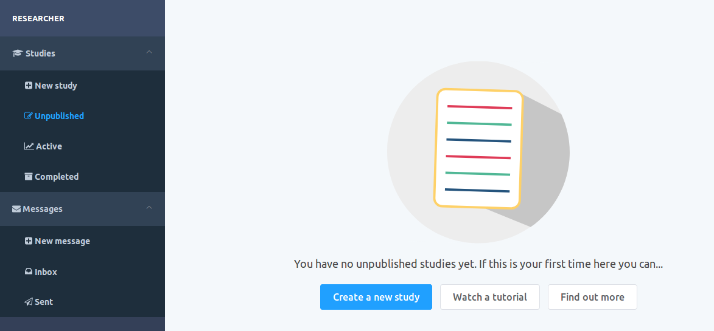
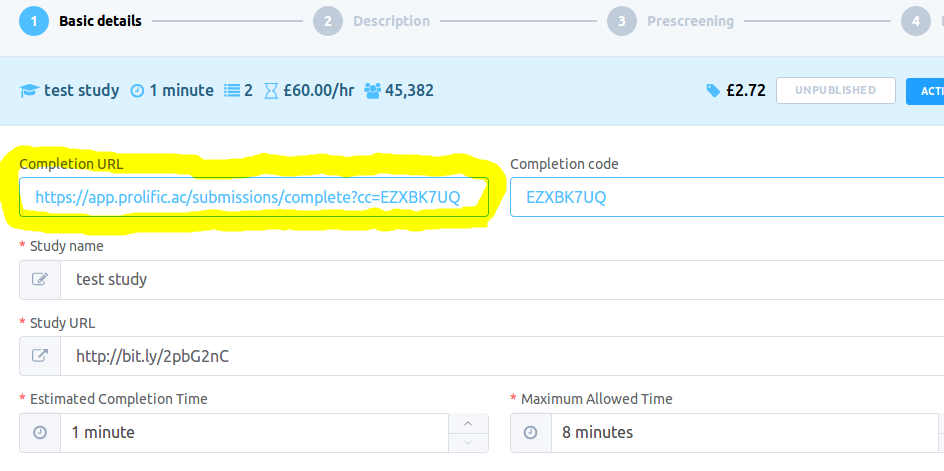

# Template for Prolific deployment


## Cloning the repo and seeing the template

```
# clone the repo, e.g.:
git clone https://github.com/babe-project/ProlificDeployTemplate

# go to 'ProlificDeployTemplate' folder

# open 'index.html' in the browser to see the template
```


## How to run experiments on Prolific

To run an experiment on Prolific, first of all, the experiment needs to be hosted somewhere (GitHub pages work fine).


The "Prolific" deploy_method adds:

* a textfiled in the introduction view that asks for participant's prolific id

* a completion url that looks like a "Confirm" button at the end of the study. The participants have to press the button to confirm that they completed the study.


### How to create a new experiment on Prolific


1. Log in Prolific as a researcher and create a new study



2. Get the completion url of the study you just created 



and replace the `"prolificURL"` value in `config/config_deploy` with the new completion URL from Prolific's website.

3. Deploy the experiment again to get the correct prolific URL on your study website.

    You can check whether the URL has been updated by checking `_url_to_your_study_/config/config_deploy.js`

4. Fill the rest of the details about your study on Prolific

    The study url is the link to your study. Make sure the completion URLs on the experiment's website and the newly created study on Prolific are the same.

5. Publish the study

    The study code that appears in the table with the completed experiments is the same as the completion code.


